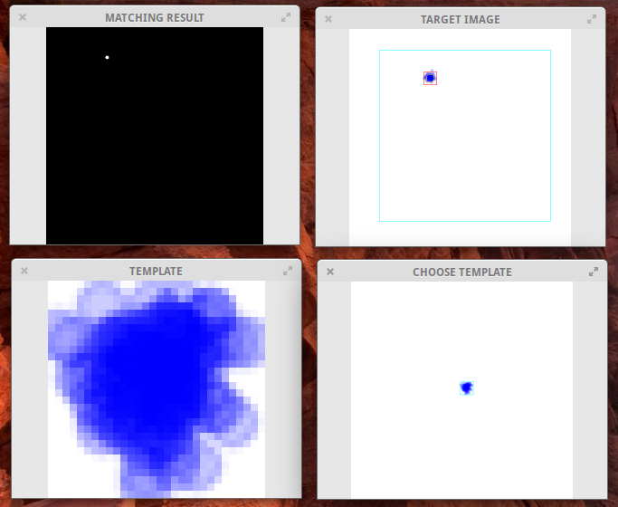

# template-matching-demo
A demo C++ application on how to use OpenCV template matching 



# Requirements
OpenCV (>2.8) http://opencv.org/

# Installation (Linux)
```
cmake .
make 
```

# Usage
The program can be run in "single" or "batch" mode

For "batch mode" open a terminal and run 

`./tracer "x.png"`

where "x" is a number between 0 and 30 (according to the image samples in the folder "images") and specifies the template file for template matching. Use the right mouse button mark the center of the template and use the left mouse button to start the actual template matching procedure. After running through all the images, a file called "positions.txt" is created, listing the x-y positions of all matched images in the batch.

For "single mode" run 

`./tracer "x.png" "y.png"`

where "y" is now the target image.

Important: The search size in the target image is not checked to fit into the image. If the template position is to close to the edge, the program will crash. This is just a simple attempt to demonstrate the template matching procedure with OpenCV. 

The Python file "generate_template_matching_data.py" can be used to create a new dataset used with "tracer.cpp"
